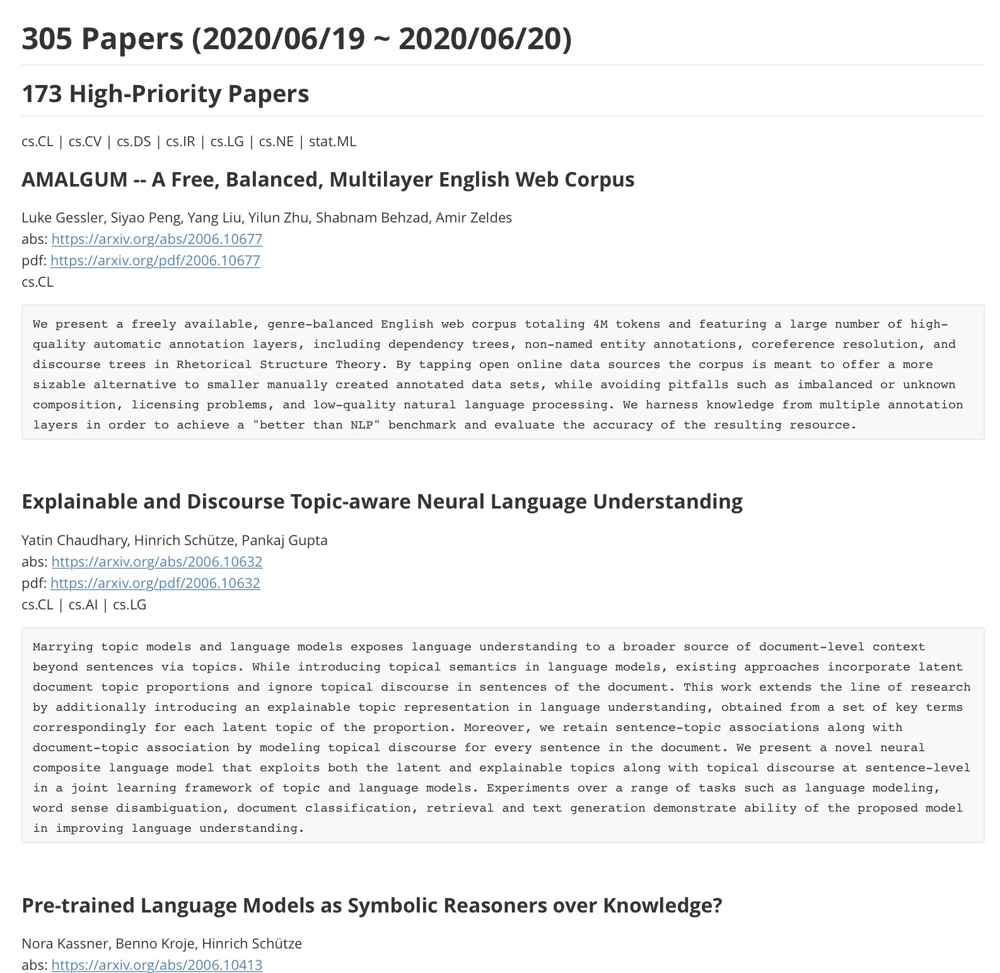

# Daily arXiv

This tool provides a functionality to

1. crawl arxiv papers
2. collect twitter comments about the cralwed papers
3. and curate them to a markdown document.


curated twitter highlights:


all the daily arxiv papers:


## Requirements

- python 3.6 or later
- python modules: see [requirements.txt]('requirements.txt').
- twitter credentials (environment variables or loaded from `.env`)
     - TWITTER_CONSUMER_KEY
     - TWITTER_CONSUMER_SECRET
     - TWITTER_ACCESS_TOKEN
     - TWITTER_ACCESS_SECRET


## Set up

1. install dependencies: `pip install requirements.txt`
2. place `.env` file on your current directory (need to contain `TWITTER_CONSUMER_KEY`, `TWITTER_CONSUMER_SECRET`, `TWITTER_ACCESS_TOKEN`, and `TWITTER_ACCESS_SECRET`).


## Usage

1. crawling all arxiv papers (`cs` and `stat.ML`) published 3 days ago

```bash
$ cd daily-arxiv
$ PYTHONPATH=src python src/tools/crawl_arxiv.py --since 3 --until 3
```

The result will be saved to `result/papers.json`.

2. collecting twitter comments 

```bash
$ cd daily-arxiv
$ python src/tools/search_twitter.py
```

The result will be saved to `result/papers_with_tweets.json`.

3. creating a markdown file curating hot papers on twitter

```bash
$ python src/tools/create_markdown.py twitter_highlight
```

The result will be saved to `result/twitter_highlights.md`.

4. creating a markdown file

```bash
$ python src/tools/create_markdown.py daily_arxiv
```

The result will be saved to `result/daily-arxiv.md`.